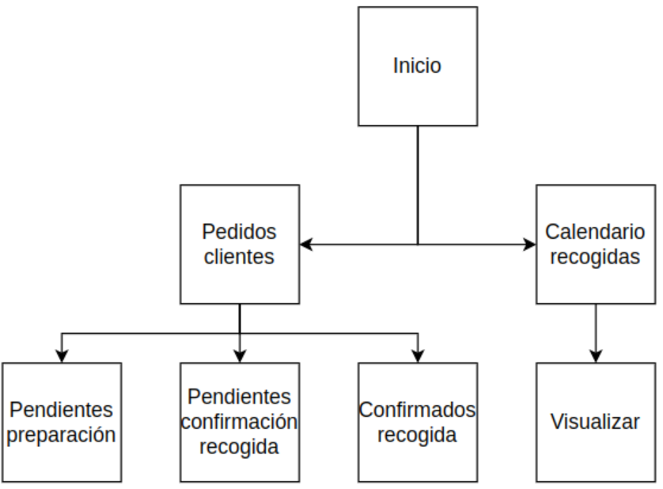
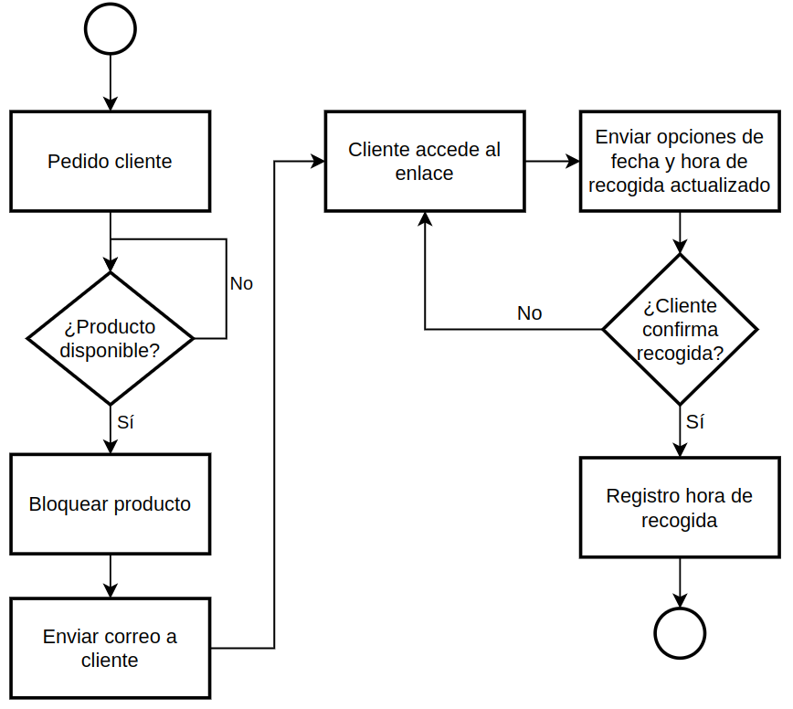
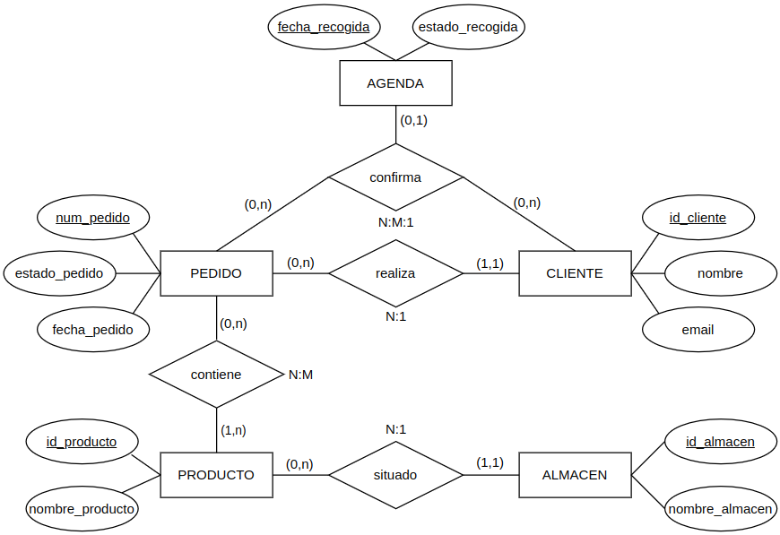

Planificar recogidas de pedidos de clientes

## Descripción detallada

El objetivo de este módulo es la planificación de la entrega de pedidos de cliente, en contacto directo con este.

Cada 12 horas se comprobará, por orden de entrada en el sistema, si los pedidos de cliente registrados están listos para su entrega (al tener suficiente stock de los productos solicitados).

En el momento que un pedido esté listo, el producto se bloqueará para dicho pedido y se le hará llegar al cliente un correo electrónico con el detalle de dicho pedido y un enlace para gestionar su recogida.

Dicho enlace le llevará a una página web con información de días y horas disponibles (en el momento que accede al enlace) por parte del almacén para realizar la entrega del pedido. El cliente seleccionará las opciones que más le interesen.

Dicha selección la registararemos en el sistema y se bloqueará ese día y hora en la planificación del almacén para no solapar entregas o recogidas de otros pedidos.

## Mapa del módulo

## Dependencias de otros módulos

- *sale_management*: gestión de pedidos de los clientes.
- *stock*: revisión cantidad de producto disponible en el almacén y su correspondiente bloqueo.

## Wireframes

### Correo

### Web

## Control de accesos

* Departamento de almacén
* Departamento de administración.
* Usuario externo (cliente).

## Diagrama de flujos

## Esquema relacional de nuevas tablas y relación con otras existentes

## Comunicación con otros módulos

- *sale_management*: consulta.
- *stock*: consulta y modificación.

